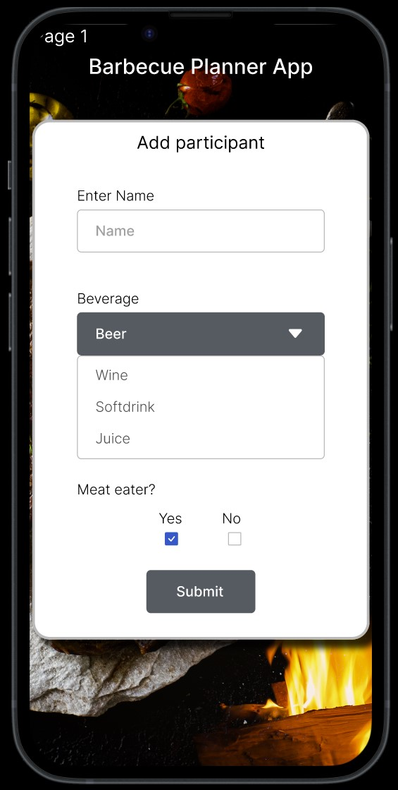

# **BBQ_Planner_T3A2-b_Front-end**

# **URL:**

#### **BBQ Planner web link hosted on Railway:**
[https://t3a2-b-front-end-production.up.railway.app/](https://t3a2-b-front-end-production.up.railway.app/)

#### **BBQ Planner Front-end Github link to source code:**
[https://github.com/dobbbo/T3A2-B-front-end](https://github.com/dobbbo/T3A2-B-front-end)

#### **BBQ Planner API web link hosted on Railway:**
[https://t3a2-b-back-end-production.up.railway.app](https://t3a2-b-back-end-production.up.railway.app)

#### **BBQ Planner Back-end Github link to source code:**
[https://github.com/Guscosta88/T3A2-B-back-end](https://github.com/Guscosta88/T3A2-B-back-end)


# **Table of contents:**

- [**Table of contents**](#table-of-contents)
    - [**R1 - Description of your website, including:**](#r1---description-of-your-website-including)

    - [**R2 - Dataflow Diagram:**](#r2---dataflow-diagram)

    - [**R3 - Application Architecture Diagram:**](#r3---application-architecture-diagram)

    - [**R4 - User Stories:**](#r4---user-stories)

    - [**R5 - Wireframes for multiple standard screen sizes, created using industry standard software:**](#r5---wireframes-for-multiple-standard-screen-sizes-created-using-industry-standard-software)

    - [**R6 - Screenshots of your Trello board throughout the duration of the project:**](#r6---screenshots-of-your-trello-board-throughout-the-duration-of-the-project)

    - [**Back-end Development**](#back-end-development)

    - [**Back-end Testing**](#back-end-testing)

    - [**Front-end Testing**](#front-end-testing)


## **R1 - Description of your website, including:**
- **Purpose**
    
    The main purpose of the Barbecue planner APP is to provide a solution to help with the quantities of food needed to perform a successful Barbecue with no waste and properly feeding everyone present considering each individual, their preferences and dietarian restricions.
    
    Problems this app solves:
    - Reduces food waste.
    - Considers each individual's preferences and food restrictions.
    - It facilitates planning.

- **Functionality / features**
    - Add people to the event's list.
    - Select specific types of drinks for each person.
    - Select options of preferences and Dietary restrictions.
    - Select Foods from a default items list containing items like salad, meats,  sausages, bread, rice, vegetarian options, etc.
    - Select Drinks from a default items list containing items like, beer, wine, softdrink, juice, etc.

    The app returns a shopping list with items and quantities.
    The app returns a list of people.

- **Target audience**

    - An individual who wants to entertain family and friends performing a barbecue.
    - A company organizing an event for its workers.
    - A professional chef or restaurant owner serving barbecue.

- **Tech stack:**
    - Deployment: Railway
    - Database: MongoDB
    - Back-end: Mongoose, Express, NodeJS
    - Frontend: React, Bootstrap
    
    - A general overview on how a MERN (MongoDB, Express, React, Node) stack works to get a better understanding on how it will be applied on this app. The application receives new data from the user or displays data retrieved from the database using React, This data passes through a web framework called Express that handles routes using Node and is then processed in a Middleware ODM (Object Data Modeling) library called Mongoose that serves JSON data to the MongoDB database, see image bellow.
    
    

    [how-does-the-mern-stack-work](https://www.bocasay.com/how-does-the-mern-stack-work/)
    

## **R2 - Dataflow Diagram:**

- The Data flow diagram process chosen for this application is known as Gane & Sarson and it is commonly used for information systems. On the Barbecue Planner App the dataflow will start by an external entity called User, the User is able to add participants info that are processed and added to the participants database, this data is retrieved from the database and displayed on the app, the user can also choose to edit or delete this information, the grocery list and the drinks list retrieves data from the participants CRUD database as well as from a previously seeded and never changing drinks and foods database, process the data and displays it.

    

    -The ERD (Entity Relationship Diagram) Bellow represents the tables and items in the database and how they interact, so we can have a clearer understanding of which of these data is being retrieved and processed in the dataflow diagram. 

    

    

    [Dataflow Diagram](https://www.lucidchart.com/pages/data-flow-diagram/how-to-make-a-dfd)

## **R3 - Application Architecture Diagram:**


## **R4 - User Stories:**


## **R5 - Wireframes for multiple standard screen sizes, created using industry standard software:**

- **Low Fidelity Wireframe:**

- For the Low-fidelity Wireframe we had a first hand sketch of the layout to visualise how the pages and features would be organized.


- **High Fidelity Wireframe:**

- We have decided to use a Design tool called Figma to create our High-fidelity Wireframe, Layouts and Prototypes showing the flow and sequence of pages, buttons and design for the 3 standard screen sizes, desktop 1440x1024, tablet 834x1194, mobile 390x844.

- **Mobile Screen size 390x844:**

- Find in the [Prototype - Mobile 390x844](https://www.figma.com/proto/8UKOCYP5rP6o3uEvtZ8zN7/T3A2-A---Wireframe?node-id=20%3A1551&scaling=scale-down&page-id=20%3A1307&starting-point-node-id=20%3A1551) a link to the Mobile version prototype containing all the pages, features and the flow between pages, you can click the buttons and it will give you a preview of the app's flow.

    

- **Tablet Screen size 834x1194:**

- Find in the [Prototype - Tablet 834x1194](https://www.figma.com/proto/8UKOCYP5rP6o3uEvtZ8zN7/T3A2-A---Wireframe?node-id=20%3A1821&scaling=scale-down&page-id=20%3A1306&starting-point-node-id=20%3A1821) a link to the Tablet version prototype containing all the pages, features and the flow between pages, you can click the buttons and it will give you a preview of the app's flow.

    

- **Desktop Screen size 1440x1024:**

- Find in the [Prototype - Desktop 1440x1024](https://www.figma.com/proto/8UKOCYP5rP6o3uEvtZ8zN7/T3A2-A---Wireframe?node-id=20%3A2089&scaling=scale-down&page-id=20%3A1305&starting-point-node-id=20%3A2089) a link to the Desktop version prototype containing all the pages, features and the flow between pages, you can click the buttons and it will give you a preview of the app's flow.

        

    [Link to Figma workspace](https://www.figma.com/file/8UKOCYP5rP6o3uEvtZ8zN7/T3A2-A---Wireframe?node-id=0%3A1&t=YRxZrLkM0EeHI3zH-1)

## **R6 - Screenshots of your Trello board throughout the duration of the project:**

# **T3A2 - Part A - Documentation**

## **Day One:**


## **Day Two:**


## **Day Three:**


## **Day Four:**


## **Day Five:**


## **Trello Board Part A - Weblink:**

[https://trello.com/invite/b/rLoXMfdJ/ATTIb8a72452a5bbaf5ffa1fb7cbc50caf1eEDBA7478/t3a2-a](https://trello.com/invite/b/rLoXMfdJ/ATTIb8a72452a5bbaf5ffa1fb7cbc50caf1eEDBA7478/t3a2-a)

# **T3A2 - Part B - Back-end - Development**

## **Day Six:**


## **Day Seven:**


## **Day Eight:**


## **Day Nine:**


# **T3A2 - Part B - Front-end - Development**

## **Day Ten:**


## **Day Eleven:**


## **Day Twelve:**


## **Day Thirteen:**


## **Day Fourteen:**


## **Day Fifteen:**


## **Day Sixteen:**


## **Trello Board Part B - Weblink:**

[https://trello.com/invite/b/E0N8yZZr/ATTI948050743fe0ec07f4ee78fcb6561efa6DED474C/t3a2-b](https://trello.com/invite/b/E0N8yZZr/ATTI948050743fe0ec07f4ee78fcb6561efa6DED474C/t3a2-b)


# **Back-end Development**

# **End Points:**

#### **BBQ Planner API web link:**
[https://t3a2-b-back-end-production.up.railway.app](https://t3a2-b-back-end-production.up.railway.app)

#### **Get All participants:**
[https://t3a2-b-back-end-production.up.railway.app/participants](https://t3a2-b-back-end-production.up.railway.app/participants)

```JSON
[
    {
        "_id": "63d06ab35489f93f1ae35627",
        "name": "Johnny",
        "drink_id": "63d06ab35489f93f1ae35623",
        "meat_eater": "No",
        "__v": 0
    },
    {
        "_id": "63d06ab35489f93f1ae35628",
        "name": "Karen",
        "drink_id": "63d06ab35489f93f1ae35623",
        "meat_eater": "Yes",
        "__v": 0
    },
    {
        "_id": "63d06ab35489f93f1ae35629",
        "name": "Angela",
        "drink_id": "63d06ab35489f93f1ae35624",
        "meat_eater": "No",
        "__v": 0
    }
]

```

#### **Get, Put, Delete participant by id:**
[https://t3a2-b-back-end-production.up.railway.app/participants/id](https://t3a2-b-back-end-production.up.railway.app/participants/id)

```JSON
[
    {
        "_id": "63d06ab35489f93f1ae35627",
        "name": "Johnny",
        "drink_id": "63d06ab35489f93f1ae35623",
        "meat_eater": "No",
        "__v": 0
    }
]

```

#### **Get All beverages Seeded and Neverchanging:**
[https://t3a2-b-back-end-production.up.railway.app/beverages](https://t3a2-b-back-end-production.up.railway.app/beverages)

```JSON

[
    {
        "_id": "63d06ab35489f93f1ae35622",
        "name": "Beer",
        "quantity": 2,
        "__v": 0
    },
    {
        "_id": "63d06ab35489f93f1ae35623",
        "name": "Wine",
        "quantity": 1,
        "__v": 0
    },
    {
        "_id": "63d06ab35489f93f1ae35624",
        "name": "Juice",
        "quantity": 1,
        "__v": 0
    },
    {
        "_id": "63d06ab35489f93f1ae35625",
        "name": "Softdrink",
        "quantity": 2,
        "__v": 0
    }
]

```

#### **Get All foods Seeded and Neverchanging:**
[https://t3a2-b-back-end-production.up.railway.app/foods](https://t3a2-b-back-end-production.up.railway.app/foods)

```JSON

[
    {
        "_id": "63d06ab35489f93f1ae3562c",
        "name": "Beef",
        "quantity": 0.3,
        "cont_meat": "Yes",
        "__v": 0
    },
    {
        "_id": "63d06ab35489f93f1ae3562d",
        "name": "Sausage",
        "quantity": 0.3,
        "cont_meat": "Yes",
        "__v": 0
    },
    {
        "_id": "63d06ab35489f93f1ae3562e",
        "name": "Potato Salad",
        "quantity": 0.3,
        "cont_meat": "No",
        "__v": 0
    },
    {
        "_id": "63d06ab35489f93f1ae3562f",
        "name": "Veg Sausage",
        "quantity": 0.3,
        "cont_meat": "No",
        "__v": 0
    }
]

```

# **Back-end Testing**

#### **End to End Automated testing:**

 - The type of testing we have decided to perform is the Automated End to End testing and the technology chosen to perform the test is the jest and supertest dependencies. The testing code covers an array of scenarios such as Getting Home Page, Creating a new participant, getting a participant's list and checking the quantity of elements and its data structure. Getting a beverage's list and checking the quantity of elements and its data structure. Getting a food's list and checking the quantity of elements and its data structure.
    An "app.test.js" file was created containing the following code that was run using the command "npm test":

```javascript

import app from './app.js'
import request from 'supertest'

describe("App tests", () => {
    test('Get Home Page', async () => {
    const res = await request(app).get('/')
    expect(res.status).toBe(200)
    expect(res.body.info).toBeDefined()
    expect(res.body.info).toBe('Barbecue Planner API')
})

describe('Get Participants list', () => {
    let res

    beforeEach(async () => {
        res = await request(app).get('/participants')
        expect(res.status).toBe(200)
    })
    it('Return an array with 6 elements', () => {
        expect(res.body).toBeInstanceOf(Array)
        expect(res.body.length).toBe(6)
    })
    it('it has the correct data-structure', () => {
        res.body.forEach(it => {
            expect(it._id).toBeDefined()
            expect(it.name).toBeDefined()
            expect(it.drink_id).toBeDefined()
            expect(it.meat_eater).toBeDefined()
            expect(it._id.length).toBe(24)
        })
        expect(res.body[0].name).toBe('John')
    })
})

describe('Get Beverages list', () => {
    let res

    beforeEach(async () => {
        res = await request(app).get('/beverages')
        expect(res.status).toBe(200)
    })
    it('Return an array with 4 elements', () => {
        expect(res.body).toBeInstanceOf(Array)
        expect(res.body.length).toBe(4)
    })
    it('it has the correct data-structure', () => {
        res.body.forEach(it => {
            expect(it._id).toBeDefined()
            expect(it.name).toBeDefined()
            expect(it.quantity).toBeDefined()
            expect(it._id.length).toBe(24)
        })
        expect(res.body[0].name).toBe('Beer')
    })
})

describe('Get Foods list', () => {
    let res

    beforeEach(async () => {
        res = await request(app).get('/foods')
        expect(res.status).toBe(200)
    })
    it('Return an array with 4 elements', () => {
        expect(res.body).toBeInstanceOf(Array)
        expect(res.body.length).toBe(4)
    })
    it('it has the correct data-structure', () => {
        res.body.forEach(it => {
            expect(it._id).toBeDefined()
            expect(it.name).toBeDefined()
            expect(it.quantity).toBeDefined()
            expect(it.cont_meat).toBeDefined()
            expect(it._id.length).toBe(24)
        })
        expect(res.body[0].name).toBe('Beef')
    })
})

test('Create new Participant', async () => {
    const res = await request(app).post('/participants').send({
        name: 'Daniel',
        drink_id: '63d32fd81c20cfb6b245eeac',
        meat_eater: 'Yes'
    })
    expect(res.status).toBe(201)
    expect(res.body._id).toBeDefined()
    expect(res.body.name).toBeDefined()
    expect(res.body.drink_id).toBeDefined()
    expect(res.body.meat_eater).toBeDefined()
    expect(res.body.name).toBe('Daniel')
    expect(res.body.drink_id._id).toBe('63d32fd81c20cfb6b245eeac')
    expect(res.body.meat_eater).toBe('Yes')
})

})

```

#### **The Test Result after running "npm test"**


# **Front-end Testing**

#### **End to End Automated testing:**

```javascript

import '@testing-library/jest-dom' 
import { render, screen } from "@testing-library/react"
import userEvent from '@testing-library/user-event'
import App from "./App"

describe('App Component', () => {
    it('Add Participant', () => {
        const { container } = render(
            <App />
        )
        expect(container.querySelector("h5")).toBeDefined()
        expect(container.querySelector("h5")).toHaveTextContent('Add Participant')
        // console.log(screen.getByRole("heading", { level: 5 }))
    })

    it('Shows Participants List when Submit is clicked', async () => {
        const { container } = render(
            <App />
        )
        await userEvent.click(screen.getByText('Submit'))
        expect(container.querySelector("h5")).toBeDefined()
        expect(container.querySelector("h5")).toHaveTextContent('Participants List')
    })
    it('Shows Shopping List when Shopping List button is clicked', async () => {
        const { container } = render(
            <App />
        )
        await userEvent.click(screen.getByText('Shopping List'))
        expect(container.querySelector("h5")).toBeDefined()
        expect(container.querySelector("h5")).toHaveTextContent('Shopping List')
    })
})

___________________________________


Npm Packages used for the test

vitest jsdom 
@testing-library/react 
@testing-library/react-hooks 
@testing-library/user-event 
@testing-library/jest-dom

```
#### **The Test Result after running "npm test"**


    